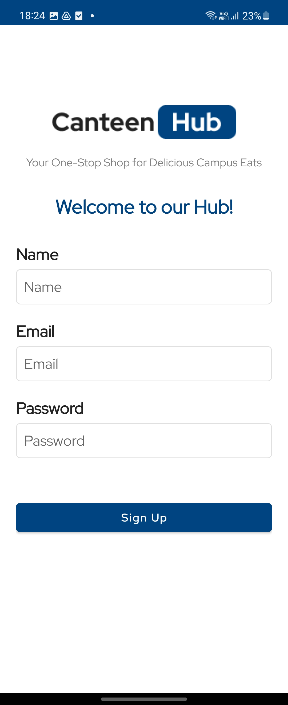
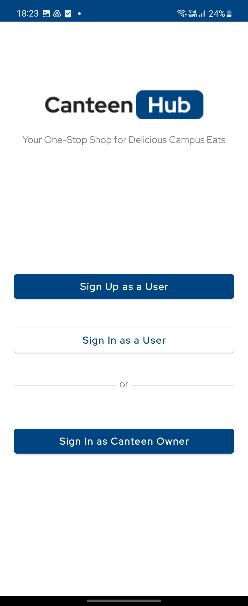
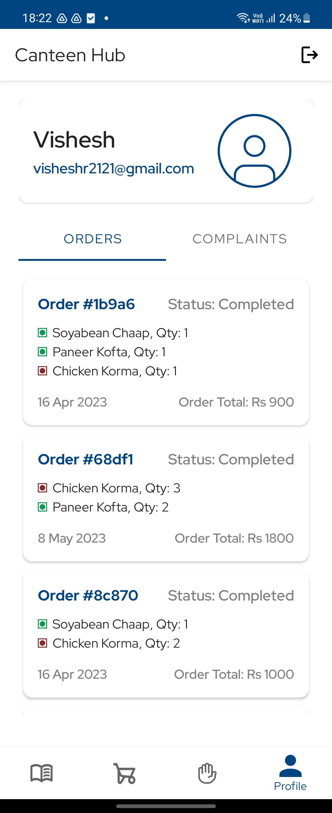
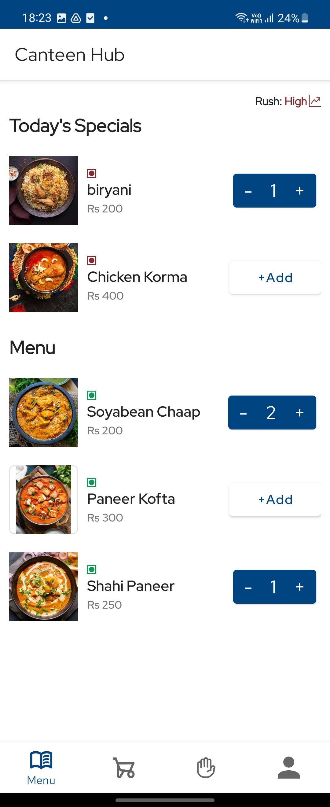
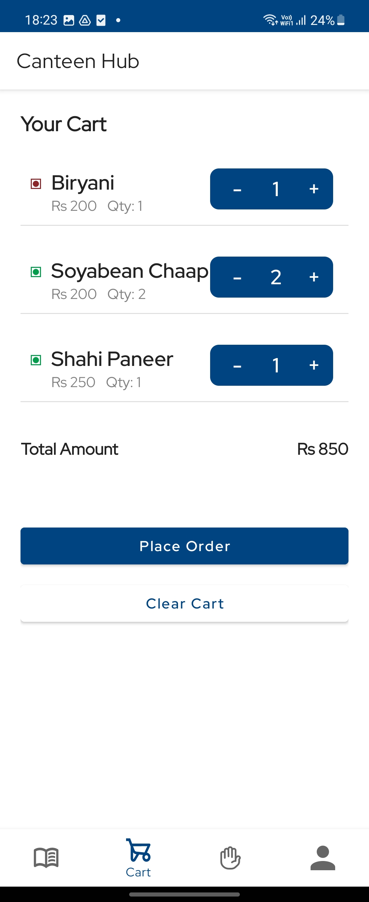
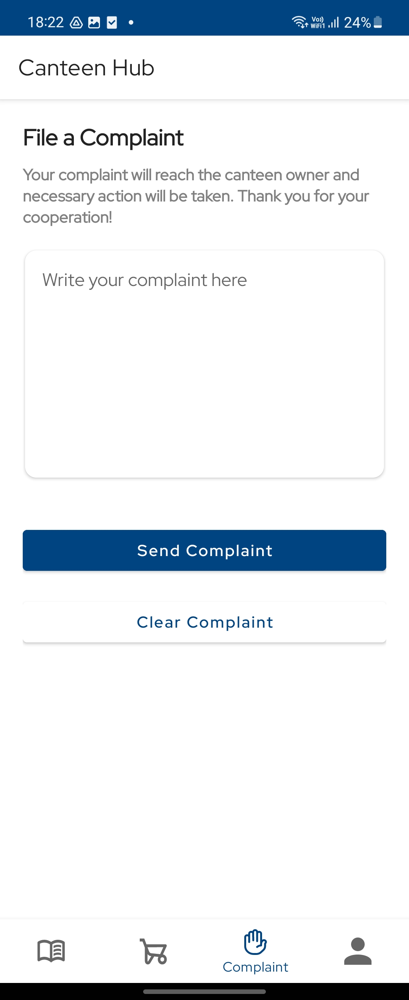
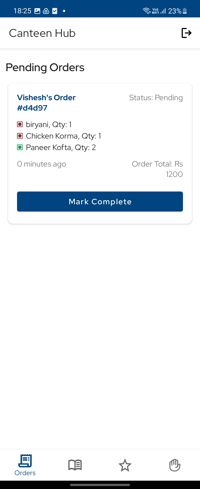
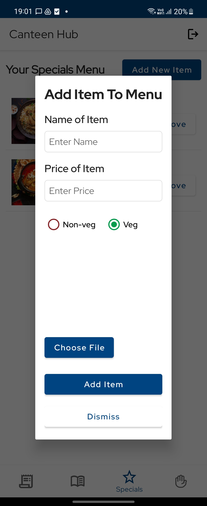
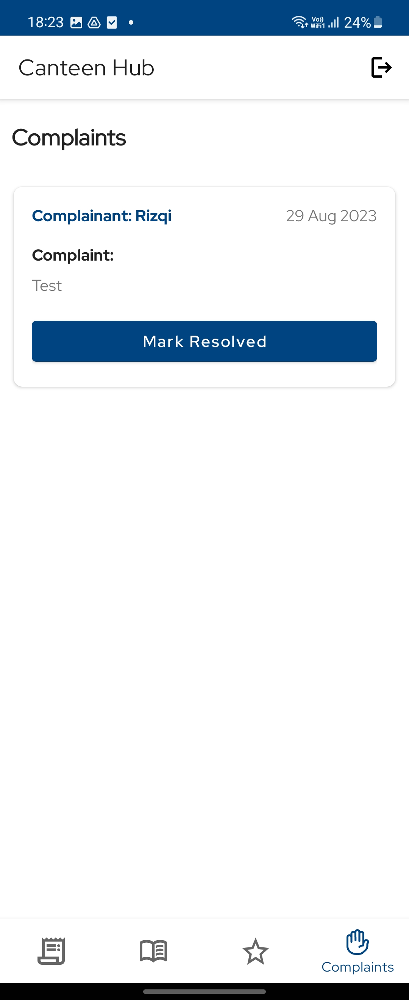

# Project-Kotlin

CanteenHub app digitizes the canteen of our college and provides interfaces for both students and the canteen vendor. 

App uses Firebase for Authentication, Firestore and Cloud Storage.

## Features:

  #### For Customer
  * Menu Browsing
  * Cart functionality
  * Complaints tracker
  * User Profile
  * Order History
  * Live Rush determination in canteen
  * Payment using RazorPay Gateway API
  * Notifications for order ready, complaint addressed, new special item added.

  #### For Vendor
  * Track of Pending and completed orders
  * Complaints tracker and redressal
  * Update the menu
  * Add special item and send notification.
  

### Sign Up

<table>
  <tr>
    <td></td>
    <td></td>
  </tr>
</table>

### Customer Interface:

<table>
  <tr>
    <td colspan="2"></td>
    <td colspan="2"></td>
  </tr>
  <tr>
    <td></td>
    <td></td>
    <td></td>
    <td></td>
  </tr>
</table>

## Vendor Interface

<table>
  <tr>
    <td colspan="2"></td>
  </tr>
  <tr>
    <td></td>
    <td></td>
    <td></td>
  </tr>
</table>